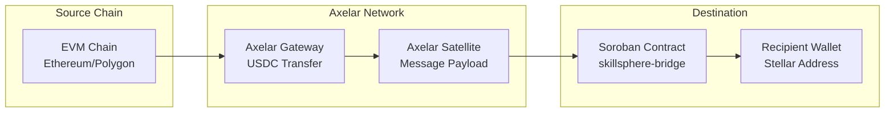

# IBC Cross-Chain Bridge Design (Axelar)

## Why Axelar?

Axelar is chosen as the cross-chain messaging solution for SkillSphere due to the following advantages over alternatives like Wormhole and LayerZero:

### Axelar Advantages

1. **EVM Compatibility**: Direct support for Ethereum and Polygon with well-established gateway contracts
2. **Soroban Integration**: Axelar's cross-chain messaging is designed for Stellar/Soroban ecosystem with native Rust SDK support
3. **Threshold Signature Security**: Uses a decentralized validator set with threshold signatures, reducing single-point-of-failure risks
4. **Gas Abstraction**: Supports gasless message passing where the relayer pays fees and is reimbursed by the destination contract
5. **Message Authentication**: Built-in payload authentication without requiring additional oracle infrastructure
6. **Production Maturity**: Already deployed and tested across multiple mainnets with established bridge contracts

### Comparison with Alternatives

| Feature | Axelar | Wormhole | LayerZero |
|---------|--------|----------|-----------|
| Soroban Support | Native | Limited | None |
| EVM Chains | Ethereum, Polygon, BSC, Avalanche | Ethereum, Solana, BSC, others | Ethereum, Polygon, Arbitrum, Optimism |
| Message Auth | Threshold sigs | Guardian network | Endpoint verification |
| Gas Abstraction | Yes | No | Limited |
| Ecosystem Maturity | High | Medium | Growing |

## Architecture Diagram



### ASCII Architecture

```
┌─────────────────────────────────────────────────────────────────────────────┐
│  ETHEREUM / POLYGON                                                          │
│  ┌─────────────┐    ┌──────────────┐                                        │
│  │ User Wallet │───►│ Axelar       │                                        │
│  │ (USDC)      │    │ Gateway      │   Locks USDC, emits cross-chain msg      │
│  └─────────────┘    └──────────────┘                                        │
└──────────────────────────────────┬──────────────────────────────────────────┘
                                   │
                                   ▼
┌─────────────────────────────────────────────────────────────────────────────┐
│  AXELAR RELAY NETWORK                                                      │
│  ┌─────────────────────────────────────────────────────────────────────┐  │
│  │ Axelar validators collect, verify, and forward message with payload    │  │
│  │ Payload: {source_chain, source_address, token, amount, recipient, nonce}│  │
│  └─────────────────────────────────────────────────────────────────────┘  │
└──────────────────────────────────┬──────────────────────────────────────────┘
                                   │
                                   ▼
┌─────────────────────────────────────────────────────────────────────────────┐
│  STELLAR / SOROBAN                                                          │
│  ┌──────────────────┐    ┌───────────────────────────────────────────────┐   │
│  │ skillsphere-     │───►│ Receives Axelar message                       │   │
│  │ bridge.rs        │    │ Validates relayer auth + nonce                │   │
│  │                  │◄───│ Credits recipient account/wallet              │   │
│  └──────────────────┘    └───────────────────────────────────────────────┘   │
└─────────────────────────────────────────────────────────────────────────────┘
```

## Message Flow for USDC Cross-Chain Payment Settlement

### Inbound Flow (EVM → Stellar)

1. **User Initiation** (Ethereum/Polygon):
   - User calls `IAxelarGateway.approveToken(address(USDC))` to approve USDC spending
   - User calls `IAxelarGateway.payGasForContractCall` with destination = Axelar gateway
   - Payload is serialized: `{destination_chain: "Stellar", destination_address: <Stellar recipient>, amount, nonce}`
   - `usdc.transferFrom(user, gateway, amount)` locks USDC on EVM

2. **Axelar Relay**:
   - Axelar validators observe the transaction
   - Payload is gossiped across the Axelar network
   - Threshold signature is assembled for message authenticity

3. **Soroban Contract Reception**:
   - `receive_bridge_message(BridgeMessage)` is called by Axelar's trusted relayer
   - Contract validates:
     - Sender is authorized Axelar relayer address
     - Nonce has not been used before (replay protection)
     - Destination chain is supported
   - Contract mints equivalent Stellar-based USDC (or uses existing token handler)
   - Event `bridge_message_received` is emitted

### Outbound Flow (Stellar → EVM)

1. `initiate_bridge_out(destination_chain, recipient, amount)` is called
2. Contract locks/burns Stellar USDC held in contract escrow
3. Cross-contract call to Axelar gateway on Stellar
4. Axelar forwards message to EVM destination
5. USDC is released to recipient on EVM side

## Security Considerations

### Replay Attacks

- **Nonce Tracking**: Each bridge message includes a unique `nonce` that must be stored and checked
- **Storage Key**: `BridgeNonce(source_chain, source_address, nonce)` prevents replay
- **Incremental Nonces**: Recommended to use incrementing nonces per source address

### Message Validation

- **Relayer Authentication**: Only Axelar's pre-configured relayer address can call `receive_bridge_message`
- **Signature Verification**: Axelar provides threshold signature proof; contract verifies via Axelar SDK
- **Chain Whitelisting**: Valid `source_chain` values are whitelisted in contract storage

### Trusted Relayer Model

- **Axelar Gateway Address**: Stored in `BridgeRelayer` instance key
- **Admin-Only Updates**: Only contract admin can update the relayer address
- **Multi-Signature**: Axelar's threshold model means >50% of validators must agree

### Additional Security Measures

1. **Rate Limiting**: Per-account daily bridge limits
2. **Amount Caps**: Maximum bridge amount per transaction
3. **Grace Period**: Optional delay before funds are released
4. **Event Logging**: All bridge actions emit indexed events for monitoring

## Fallback / Refund Logic

### Bridge Failure Scenarios

| Scenario | Handling |
|----------|----------|
| Message never arrives | User can initiate refund after timeout via `request_refund(nonce)` |
| Invalid message | Contract rejects; user must contact support for manual recovery |
| Chain outage | Retry mechanism; events stored for replay once connectivity restored |

### Refund Process

1. User detects missing funds after `BRIDGE_TIMEOUT_SECS` (default: 24 hours)
2. User calls `request_refund(nonce)` with original transaction details
3. If nonce is found in pending state and timeout elapsed, funds are returned
4. Event `bridge_refund` is emitted for indexer tracking

### Recovery Functions

```rust
pub fn request_refund(env: Env, source_chain: String, source_address: String, nonce: u128) -> Result<(), BridgeError>
pub fn emergency_withdraw(env: Env, token: Address, amount: i128) -> Result<(), BridgeError> // admin only
```

## Contract Storage Layout

```
Instance Storage:
- BridgeRelayer: Address — Authorized Axelar gateway/relayer address
- BridgePaused: bool — Emergency pause flag

Persistent Storage:
- BridgeMessage(Key): BridgeMessage — For tracking pending/received messages
- BridgeNonce(source_chain, source_address, nonce): bool — Replay protection
- PendingRefund(nonce): RefundRequest — Pending refund tracking
```

## References

- [Axelar documentation](https://docs.axelar.network/)
- [Axelar Soroban integration](https://github.com/Axelar-Network/axelar-contract-gateway)
- [Stellar USDC token contract](https://stellar.expert/explorer/public/contract/USD...)